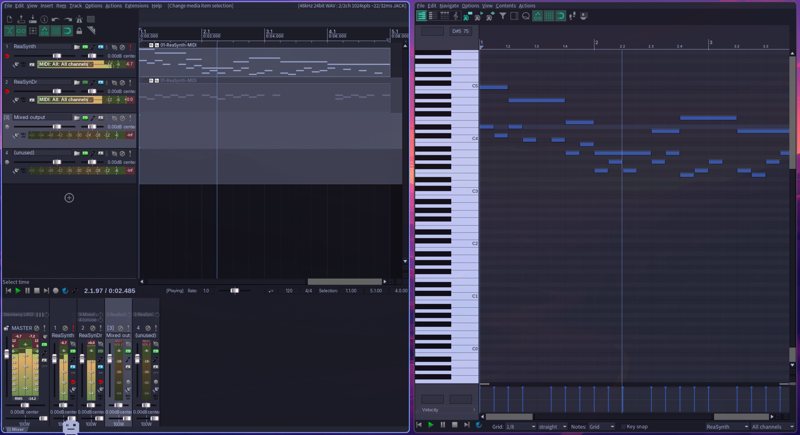
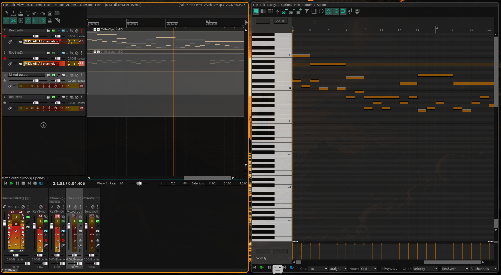
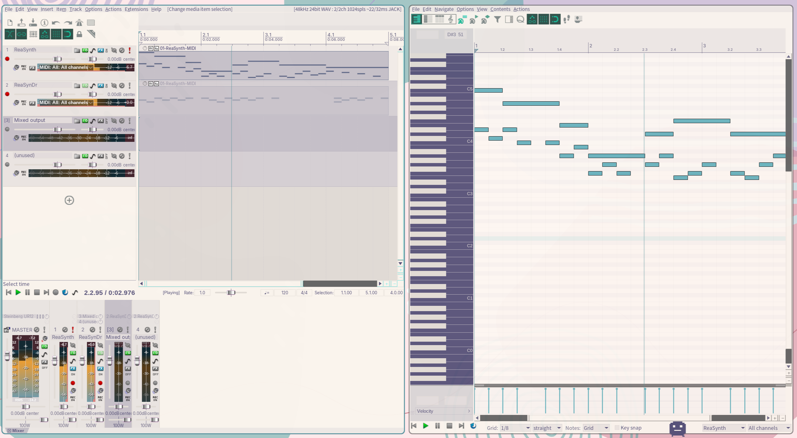
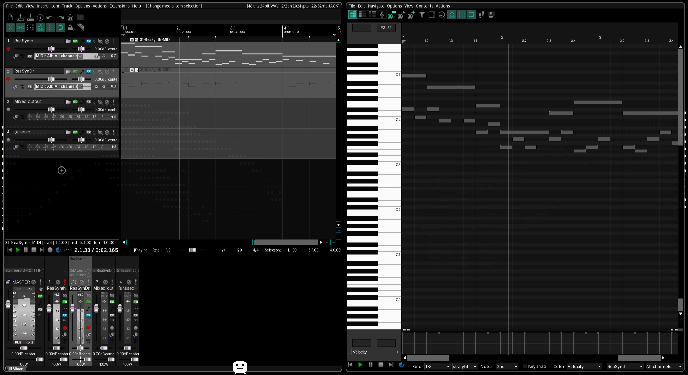
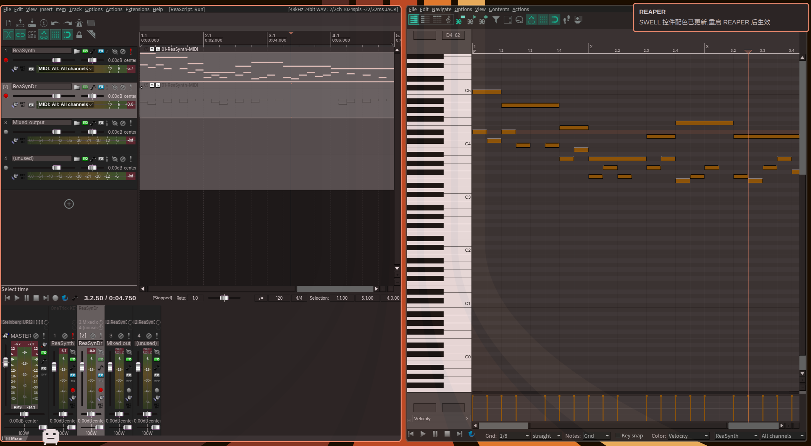

# REAPER ↔ Omarchy 主题联动



## 使用

```bash
omarchy hook install theme-set ./reaper-omarchy-theme
omarchy theme set "$(omarchy theme current)"
```

## 原理

读取当前 Omarchy 主题调色板（`colors.toml`），写入 REAPER 的两个**原生接口**：

| REAPER 原生接口 | 覆盖范围 | 生效时机 |
|---|---|---|
| `.ReaperTheme`（`col_*` 颜色） | 编辑区 · 走带 · 列表 · MIDI 编辑器 | 切换主题**即时热重载** |
| `libSwell-user.colortheme` | SWELL 原生控件（FX 浏览器 · 菜单 · 对话框） | 重启 REAPER 生效（会弹通知提醒） |

## 生成文件

- `~/.config/REAPER/ColorThemes/Omarchy.ReaperTheme`
- `~/.config/REAPER/Scripts/Omarchy/load-omarchy-theme.lua` —— 热重载注入脚本
- `~/.config/REAPER/libSwell-user.colortheme`

## 效果

### metta-black


### rose-pine


### tokyo-night


### vetablack


### SWELL 更新通知


## 致谢

热重载框架来自 [nofatetech/reaper-omarchy-theme](https://github.com/nofatetech/reaper-omarchy-theme)（其中 SWELL 配色与通知部分已作为 [PR #1](https://github.com/nofatetech/reaper-omarchy-theme/pull/1) 回馈上游）。

本仓库在其基础上做了一些**个人向调整**：对比度插值参数 i love omarchy !
